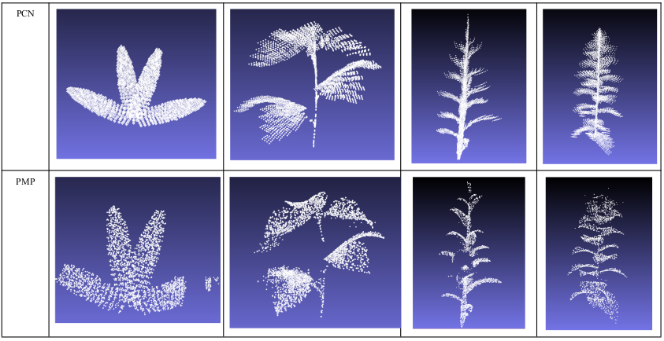
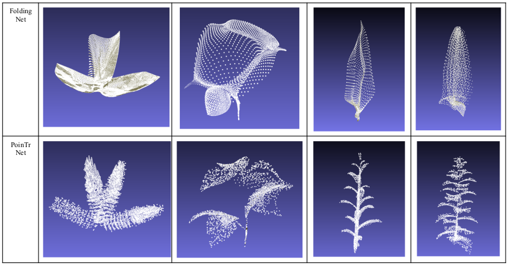
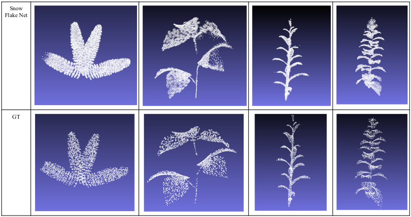

# 3D Point Cloud Reconstruction Using Deep Learning

#### Yipeng Liu, Yide Ma, Zhuocheng Guo, Mingwei Sui

## Introduction:
In our project, we were given 4 groups of plants as datasets. We compared the performance of 6 types of point completion networks on plant-related point cloud datasets

## Datasets:
Using Virtual Lab creates .obj files. then using CloudCompare creates .pts files
Each plant includes 1000 samples. Each sample consists of about 3000 points. (Mimosa, Soybean, Corn, Bush)

## Neural Networks:
PCN: Point Completion Networks
Point Cloud Completion by Learning Multi-step Point Moving Paths
FoldingNet: Point Cloud Auto-encoder via Deep Grid Deformation
PoinTr: Diverse Point Cloud Completion with Geometry-Aware Transformers
SnowFlake Net
PFNet: Point Fractal Network for 3D Point Cloud Completion

## Result:
The following five nets output the whole reconstructed plant, so they may change some origin points of the input. We set approximately 4~5 hours for training one network for each plant. This is for making our comparison more reasonable.

**PF-Net only outputs the missing part of the input plants, it retains all origin points of input. The white part is the incomplete point cloud, the pink part is the model prediction, and the yellow part is the ground truth.**

## Loss:

Overall, we find that the reconstruction of mimosa has the least loss among all four plants. This is because mimosa has the simplest shape, which is easiest to train. Bush has the most complicated 3 dimensional shape, which is the hardest to train. Compared to the losses, we can find the PF-Net is the best model in our project.

## Difficulties:
In this project, the main difficulty is to debug and re-implement the neural nets. The dataset we test every neural nets are 1000 plants for each group and 3000 points for each point cloud. We control the training time for each group of plants using one net around 4~5 hours. In this way, the spend on training is almost the same even if we have different epochs for each net.

## Analysis:
When we just started this project, we searched for these nets and had an impression in our mind. PCN uses mlp to understand the global feature and try to generate a shape based on the information it gains. So for PCN, it could have good performance when you input a larger amount of points in each point cloud data and more time for training. When we have equal training time, its performance might be bad at the detailed part. For PF-net, we have trained it for several times and we found in PF-net, one phenomenon always happening. Some of its points are sometimes “gathering” at places where the shape changes rapidly. However, there are also some advantages of PF-net. Since it only outputs the missing part, its performance is good at the detailed part. In addition, there is one problem with PF-net. When we are trying to give it more epoch to run, even 1000 epoch with 24hr training time. The performance is not changing at all. We did some parameter turning and the results remained the same.   Another net we have re-implement is the folding net. For the folding net we have met the situation mentioned in the essay, it needs a very large epoch to train, even more than PCN. Even though right now the shape looks far away from what we expect, but in a very large epoch, it should perform very well. Hence, when we train for around 4~5 hours, its performance is far from what we want. PMP is one net we have implemented. We think this net is not suitable for plant based point completion. PMP uses movement between points to understand the global and partial features. We think the reason for bad performance using PMP net is, it needs more density for each point cloud data. For snowflakes, when we use its original given learning rate, 0.001, the gradient explodes. Once we change the learning rate to 0.0001, it works perfectly. For snowflakes, when we are doing research we find it summarizes all good property from recent point completion nets. In conclusion, PF-net has the least loss under our setting of comparison, PoinTr net is the second net with good performance in our project. 
